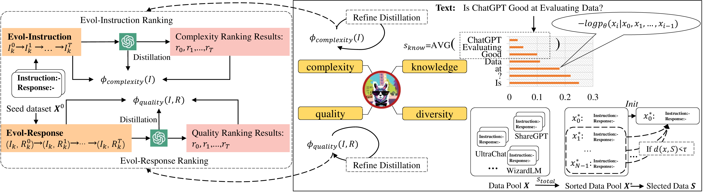

# Is ChatGPT Good at Evaluating Data? Investigating Large Language Models as DataAgent

This repository provides an original implementation of paper `Is ChatGPT Good at Evaluating Data? Investigating Large Language Models as DataAgent`.

  

## Overview
In this paper, we propose **DataAgent**, a comprehensive data evaluation framework, to evaluate data from **complexity**, **quality**, **knowledge** and **diversity** perspective for instruction fine-turning (IFT).

## Fundation Models
|   Model  | Link |
|:--------|:--------:|
| LLaMA1-13B | [yahma/llama-13b-hf](https://huggingface.co/yahma/llama-13b-hf) |
|  LLaMA2-13B  | [meta-llama/Llama-2-13b-hf](https://huggingface.co/meta-llama/Llama-2-13b-hf) |
| Mistral-7B-v0.1 | [mistralai/Mistral-7B-v0.1](https://huggingface.co/mistralai/Mistral-7B-v0.1)|

## Data Pool
|   Data Size  | Link |
|:--------|:--------:|
| 300K | [link](https://huggingface.co/datasets/AndrewZeng/deita_sota_pool) |

## Acknowledgement
For training code, we use the code from [LLaMA-Factory](https://github.com/hiyouga/LLaMA-Factory).

For evaluating conversational benchmarks (MT-Bench and AlpacaEval), we use the code from [FastChat](https://github.com/lm-sys/FastChat) and [alpaca_eval](https://github.com/tatsu-lab/alpaca_eval).

For evaluating traditional LLM benchmarks (ARC, HellaSwag, MMLU and TruthfulQA), we use the code from [lm-evaluation-harness](https://github.com/EleutherAI/lm-evaluation-harness).
